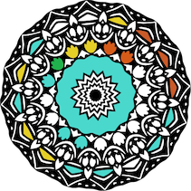

# Mandala
> An SVG-based responsive web application built with AngularJS, Node.js, Express, and PostgreSQL

https://mandala-capstone.herokuapp.com

I completed this application, including ideation, wireframing, backend development, and front end development, over the course of 2 weeks. This was an individual assignment for the 24-week Galvanize web development immersive course.
